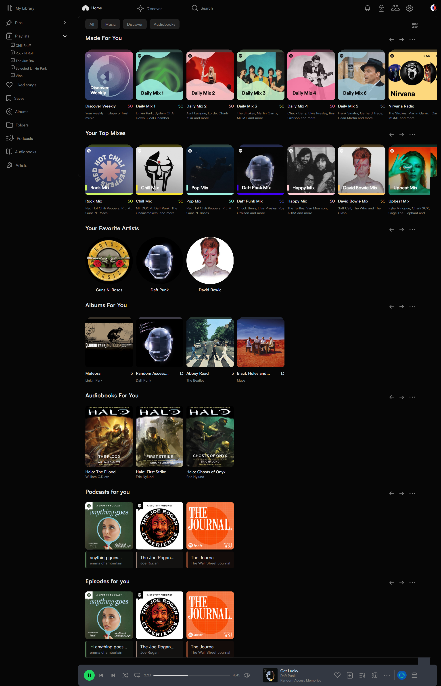

```
███████╗██████╗  ██████╗ ████████╗██╗███████╗██╗   ██╗
██╔════╝██╔══██╗██╔═══██╗╚══██╔══╝██║██╔════╝╚██╗ ██╔╝
███████╗██████╔╝██║   ██║   ██║   ██║█████╗   ╚████╔╝ 
╚════██║██╔═══╝ ██║   ██║   ██║   ██║██╔══╝    ╚██╔╝  
███████║██║     ╚██████╔╝   ██║   ██║██║        ██║   
╚══════╝╚═╝      ╚═════╝    ╚═╝   ╚═╝╚═╝        ╚═╝   
```

# 🎧 Spotify Markup Project

*A responsive music streaming interface inspired by Spotify's UI and layout structure.*


---

## 📖 Project Overview

The **Spotify Markup Project** is a responsive music streaming interface inspired by Spotify's UI and layout structure.

The goal of the project was to recreate the experience of a modern music streaming platform using semantic HTML, SCSS architecture, and modern CSS layout techniques. The project emphasizes component-based design, responsive layout behavior, and interactive UI elements implemented without JavaScript.

The interface includes multiple sections such as navigation systems, playlist structures, album layouts, podcast pages, and artist information pages.

---

## 🏗️ Project Architecture

The project follows a component-based structure where each major UI element is isolated and reusable.

**Main principles used:**

- 📝 Semantic HTML structure
- 🎨 SCSS architecture with variables and mixins
- ♻️ Reusable components
- 📐 Responsive layout techniques
- ☑️ Checkbox-based UI logic for interactivity
- 🔀 Clean Git workflow with pull requests

Every major element such as Albums, Buttons, Filters, Account Components, and Navigation has its own dedicated file, ensuring the codebase remains organized and maintainable.

---

## 👥 Team Contributions

| Team Member | Owned Scope |
|---|---|
| **Mariam Natchkebia** | Navigation system, personalized home content, search & discovery page, playlist layouts, podcast pages, interactive filtering systems |
| **Sophie Odikadze** | Main layout, hero section, artist page with nested pages, album layouts, section with `<table>`, Sass partials, player-bar, ASIDE |
| **Qristine Mirzoian** *(Ex member)* | Aside component *(never completed)* |

> 💡 SCSS variables and mixins were shared and used collaboratively across the project.

---

## 🙋 Individual Contributions


## 🎵 Mariam Natchkebia

### 🏠 Home Page & Personalized Content

Developed the personalized dashboard sections displayed on the Home Page.

**Key components include:**

**Dynamic Content Sections**
- Made For You
- Your Top Mixes
- Albums For You
- Audiobooks For You

**Interactive UI**
- Custom hover animations for all Home Page buttons
- Smooth interactive transitions for improved UX

**Functional Sidebars**

Implemented advanced UI behavior using checkbox logic instead of JavaScript.

Components include:

- **Friend Activity Sidebar** — Displays real-time friend listening activity. Visibility controlled using checkbox toggle logic
- **Account Management Component** — Simulates account menus and dropdowns. Fully interactive using CSS-based toggles

---

### 🔍 Search & Discovery Page

Designed a structured discovery system for browsing music content.

**Key implementations:**

- **Album Grid** — Structured album display using semantic HTML. Responsive grid layout with precise SCSS styling
- **Song Components** — Reusable UI component representing individual tracks. Includes metadata display and hover interactions
- **Search Filtering System** — Interactive filters implemented with checkbox logic. Allows users to sort and filter displayed content dynamically

---

### 📚 My Library Page

Built a structured library interface capable of handling large amounts of content.

**Features include:**
- Clean Information Hierarchy
- **Pin Feature** — Allows users to prioritize playlists and albums
- Reusable Filtering System shared across multiple pages for consistent UX

---

### 🎙️ Podcasts & Episode Navigation

Developed a dedicated podcast experience.

- **Podcast Landing Page** — Created a hub page for The Joe Rogan Experience
- **Episode Cards** — Modular episode components for displaying podcast content
- **Deep Linking Navigation** — Clicking the first episode navigates to a standalone episode page

---

### 🎼 Playlist Layout System

Developed specialized playlist layouts for different content structures.

**Key aspects:**
- Separate HTML and SCSS structures for playlist variations
- SCSS variables used to maintain visual consistency
- Component-based playlist display architecture

---

### 🎨 Design System & Styling

Focused heavily on maintainability and scalability.

**Key techniques:**
- Created SCSS variables for color palettes
- Built reusable mixins for buttons and filters
- Ensured design consistency across all pages

The styling system minimizes repetition and ensures long-term maintainability.


### 🎨 Sophie Odikadze

### 🧭 Navigation & Layout

Implemented the main structural layout of the application.

**Key elements include:**

- **Sidebar Navigation** — Fully structured sidebar component. Consistent navigation across all pages. Responsive layout behavior
- **Player Bar** — Persistent player bar visible across the platform. Displays track information and playback controls. Designed to simulate a real streaming platform experience

---

### 🎤 Artist Page

Created a complete artist profile layout.

**Features include:**
- Structured presentation of artist content
- Organized sections for albums, tracks, and information
- Clean layout built using modern CSS techniques

---

### 📄 About Artist Page

Designed a dedicated page displaying artist biography and additional information.

**Highlights:**
- Semantic HTML content structure
- Clean reading layout
- Visual consistency with the rest of the platform

---

### 💿 Album Layouts

Implemented multiple album browsing formats.

- **Grid Album View** — Balanced visual layout for browsing albums
- **List Album View** — Detailed album display including metadata
- **Layout Switching** — Allows users to switch between grid and list views while maintaining consistent styling

---

### 🎨 Design Consistency

Focused on scalable and reusable styling systems.

**Implemented:**
- Shared SCSS variables
- Reusable styling patterns
- Modular UI components

This approach ensures the project remains maintainable and scalable.

---

## 🤝 Team Decisions

### 💻 Development Approach

The project was built using a **Desktop-First** approach.

Because the assignment primarily focused on desktop layouts, the team implemented the desktop interface first and later introduced responsive adjustments. Since we had predefined the responsive layout strategy from the start, the transition required minimal changes.

**To support responsiveness:**
- Clamp-based sizing
- Flexible layout structures
- Responsive spacing and typography

---

### 📋 Task Management & Team Communication

Team communication was frequent and direct.

- Daily brief discussions were held to review progress.
- Tasks were distributed and reassigned as needed.

---

### ⚠️ Main Challenge

Unfortunately, the third team member frequently missed meetings and provided inconsistent progress updates.

**Because of this situation:**

The remaining work was redistributed among the two active members. Both members took responsibility for:
- Pull Request reviews
- Project quality control
- Overall progress management

---

### 🏷️ Naming Convention

Descriptive class names were used throughout the project to ensure:
- Readability
- Consistency
- Maintainability

---

### 🔀 Workflow

The project followed a structured Git workflow:

```
feature branch → development → Pull Request → code review → merge
```

- Each feature was developed in separate branches
- Changes were integrated using Pull Requests
- Team members reviewed each other's code before merging

This ensured code quality and project stability.

---

## 🛠️ Tech Stack

- HTML
- CSS / SASS
- Git / GitHub

---

### 🧩 Component Isolation

Each UI element (Albums, Filters, Buttons, Account Components) exists in a separate file, making the structure modular and easy to maintain.

### ✅ CSS-Driven Interactivity

Instead of relying on JavaScript, the project uses advanced CSS techniques such as:

```
☑ Checkbox logic
☑ CSS state selectors  
☑ Hover interactions
```

This approach allows UI behavior such as:
- Filters
- Menu toggles

### 🎨 SCSS Architecture

The styling system uses:

```scss
// Centralized color variables
$color-primary: #1DB954;
$color-background: #121212;

// Reusable mixins
@mixin button-styles { ... }
@mixin filter-component { ... }
```

This ensures consistency while avoiding code repetition.

---

## 🎯 Project Focus

The project highlights two major aspects:

```
┌──────────────────────────────────────┐
│  1. Individual Technical Contributions│
│  2. Effective Team Collaboration      │
└──────────────────────────────────────┘
```

Both were essential in successfully completing the interface.

---
*Built with 🎵 by Mariam Natchkebia & Sophie Odikadze* 💪😎